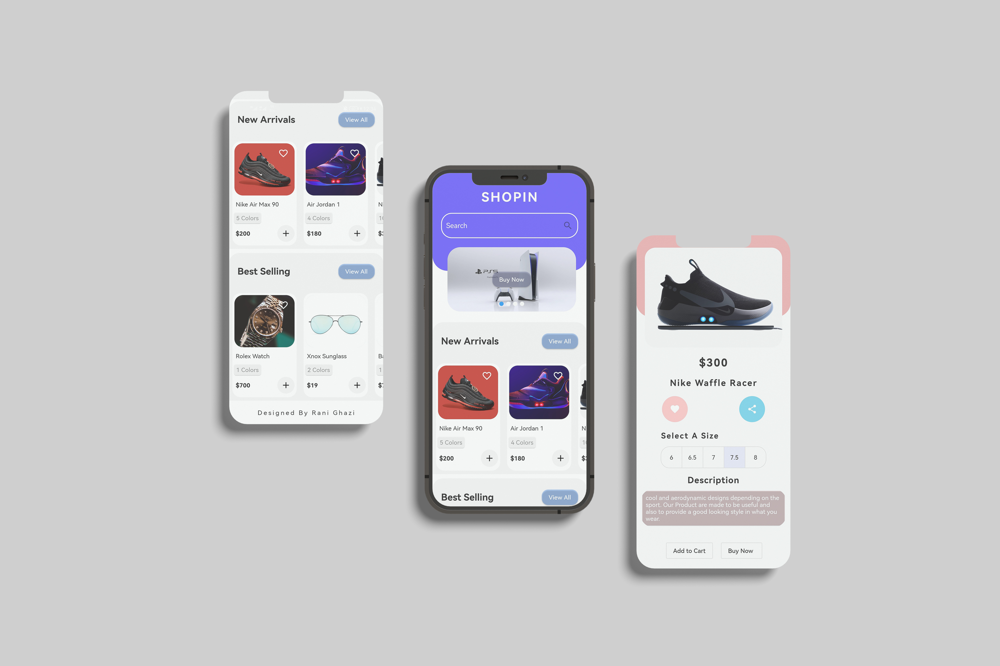

# Shopin - Flutter Shopping App

Welcome to Shopin, mobile application for all your shopping needs! Shopin is a sleek and intuitive Flutter-based shopping app designed to provide users with a seamless shopping experience. Below are some of the key features that make Shopin stand out:

## App Preview:

## Features:

- **Product Categories:** Explore a wide range of product categories, including fashion, electronics, beauty, and more, to find exactly what you're looking for.

- **New Arrivals:** Stay up-to-date with the latest products added to the store. Discover new items as soon as they hit the shelves.

- **Best Sellers:** Discover the most popular products in the store based on user preferences and trends. Find out what's trending and get your hands on the hottest items.

- **Search Functionality:** Easily search for products using keywords, categories, or specific attributes. Find what you need quickly and efficiently.

- **Product Details:** View detailed information about each product, including images, descriptions, prices, and available variations like colors and sizes.

- **Product Reviews:** Read reviews and ratings from other users to make informed purchasing decisions. Get valuable insights from real customers.

- **Favorites:** Mark products as favorites to easily access them later. Keep track of items you love and receive notifications for price changes or restocks.

- **Shopping Cart:** Add products to your shopping cart and manage your purchases effortlessly. Review your selections before proceeding to checkout.

- **Checkout Process:** Enjoy a seamless checkout experience with support for multiple payment methods. Track your orders and receive updates on delivery status.

- **User Profile:** Personalize your shopping experience by managing your user profile, addresses, and payment information. Keep your details up-to-date for a smooth shopping journey.

- **Dark Mode Support:** Switch to dark mode for a comfortable shopping experience in low-light environments. Reduce eye strain and save battery life.

## Getting Started:

To get started with Shopin, follow these simple steps:

1. Clone the repository to your local machine.
2. Install Flutter and Dart SDK if you haven't already.
3. Run `flutter pub get` to install dependencies.
4. Connect your device or start an emulator.
5. Run the app using `flutter run`.

## Contributing:

We welcome contributions from the community! If you'd like to contribute to Shopin's development, please follow these guidelines:

- Fork the repository and create a new branch for your feature or bug fix.
- Make your changes following the project's coding conventions.
- Test your changes thoroughly.
- Submit a pull request with a clear description of your changes and their purpose.
